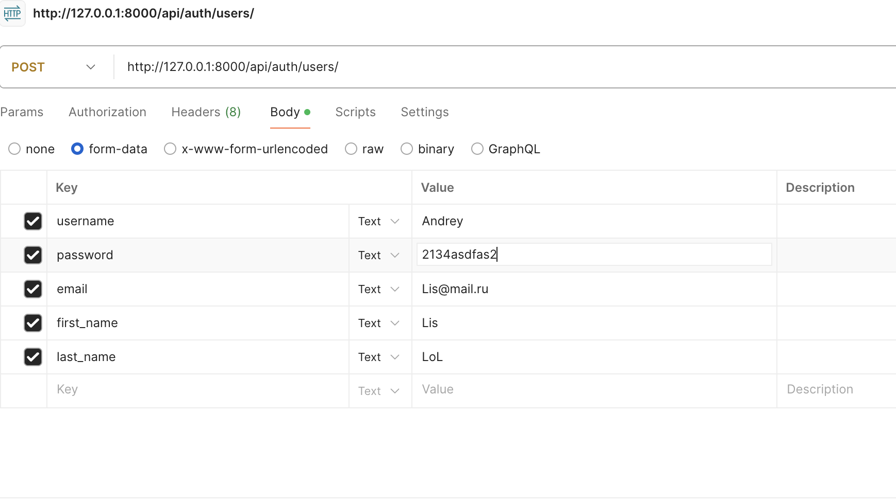

# Добро пожаловать в документацию API магазина мерча

Добро пожаловать в документацию API для магазина мерча. Этот API предоставляет функции для управления продуктами, заказами, пользователями и транзакциями.

## Тестирование API

Для тестирования API вы можете использовать команду- python manage.py test shop.tests.ProductTestCase

## Эндпоинты API
(http://127.0.0.1:8000/swagger/).
для начала надо авторизироваться 

### Продукты

- **GET /api/products/** - Получить список всех продуктов.
- **POST /api/products/** - Добавить новый продукт.
- **GET /api/products/{id}/** - Получить информацию о продукте по ID.
- **PUT /api/products/{id}/** - Обновить информацию о продукте по ID.
- **DELETE /api/products/{id}/** - Удалить продукт по ID.

### Заказы

- **GET /api/orders/** - Получить список всех заказов.
- **POST /api/orders/** - Создать новый заказ.
- **GET /api/orders/{id}/** - Получить заказ по ID.
- **PUT /api/orders/{id}/** - Обновить заказ по ID.
- **DELETE /api/orders/{id}/** - Удалить заказ по ID.

### Транзакции

- **GET /api/transactions/** - Получить список всех транзакций.
- **POST /api/transactions/** - Создать новую транзакцию.
- **GET /api/transactions/{id}/** - Получить транзакцию по ID.
- **PUT /api/transactions/{id}/** - Обновить транзакцию по ID.
- **DELETE /api/transactions/{id}/** - Удалить транзакцию по ID.

## Как использовать

- Используйте [Swagger UI](http://127.0.0.1:8000/swagger/) для тестирования всех доступных эндпоинтов.
- Для взаимодействия с API используйте REST-клиенты, такие как Postman или Curl.
